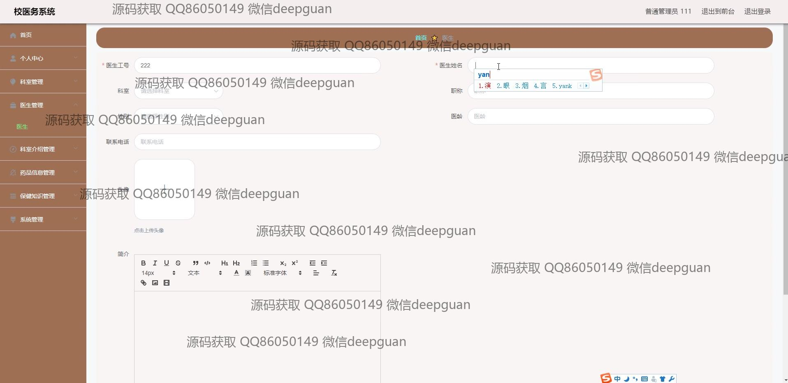

<h1 align="center">校医务系统+vue</h1>

## 简介
校医务系统：角色分为管理员、用户；功能包括医生管理、科室管理、药品信息管理、保健知识管理、新闻信息管理、个人信息管理、后台管理等；支持多模块操作及信息编辑。    --计算机毕业设计源码；毕设源码；java毕业设计源码

## 联系方式

<h3 align="center">获取完整代码与数据库文件 + 微信：deepguan QQ: 86050149 QQ群: 783742310</h3>

<h3 align="center">可帮忙远程部署 包运行成功！提供远程部署、修改代码、设计文档指导、代码讲解等服务！</h3>

## 功能介绍（完整见运行截图）
管理员：  
基本功能：管理员可以登录、注册、退出系统，切换前后台操作。  
科室管理：提供科室信息管理功能，支持输入科室名称、科室类型、科室主任及护士长信息，可上传图片并编辑科室简介。  
医生管理：支持录入医生信息，包括工号、姓名、科室、职称、性别、联系方式等，可上传医生头像并填写简介。  
药品信息管理：支持录入药品编号、名称、类型、生产日期、批次号等信息，可上传图片并通过富文本编辑框撰写药品说明。  
新闻与健康知识管理：支持新闻及健康知识的新增、修改、删除功能，提供搜索及分页浏览，包含标题、缩略图、类型和发布信息管理。

用户：  
基本功能：用户可注册并登录系统，访问个人中心查看或修改个人信息。  
网站首页：导航栏包含医生、科室介绍、药品信息、保健知识和新闻信息等模块，支持浏览和快速访问相关内容。  
科室浏览：用户可以查看科室分类和详情，支持通过搜索功能快速查找所需信息。  
保健知识与新闻：用户可浏览健康知识文章及新闻列表，查看详细内容及图片展示，获取相关保健资讯。

## 运行截图

本代码来源于网络,仅供学习参考使用!

